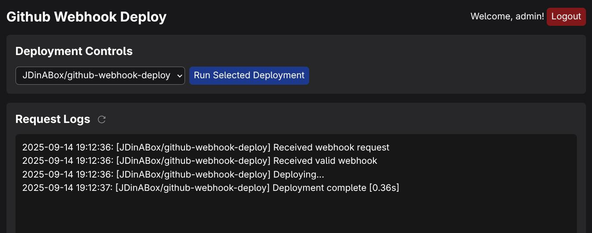
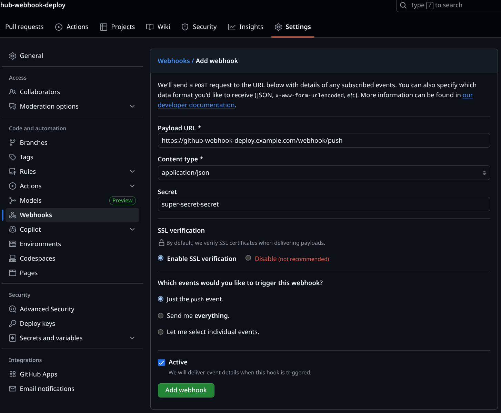

# github-webhook-deploy

A webhook server to automatically deploy GitHub repositories

## Using

[Config](#config)

### Running

```sh
github-webhook-deploy path/to/config.yaml
```

### Endpoints

- `/webhook/push` - Trigger a deployment

- Web Interface [127.0.0.1:9080](127.0.0.1:9080)
  

## Building

Go version: 1.25+

### With [GoReleaser](https://github.com/goreleaser/goreleaser) (Recommended)

Supports builds for Linux

- Arch: amd64 & arm64
- Formats: rpm, deb & apk (Untested)

[Install GoReleaser](https://goreleaser.com/install/)

```sh
git clone https://github.com/JDinABox/github-webhook-deploy.git
cd github-webhook-deploy
goreleaser release --clean --snapshot
```

Packages and binaries will be in the `dist` directory.

### With Go

```sh
git clone https://github.com/JDinABox/github-webhook-deploy.git
cd github-webhook-deploy
GOEXPERIMENT=jsonv2 go build -o ./github-webhook-deploy ./cmd/github-webhook-deploy/
```

### Rebuilding web interface assets (Optional: Included in repo)

[TailwindCSS CLI](https://tailwindcss.com/docs/installation/tailwind-cli)

```sh
tailwindcss -m -o ./templates/assets/output.css
```

## Installing

### GoReleaser Build

Install package from `dist`

Edit [Config](#config)

Enable & Start `github-webhook-deploy` service

### Manual Installation

1. Binary install

   ```sh
   cp ./github-webhook-deploy /usr/bin/github-webhook-deploy
   chmod 0755 /usr/bin/github-webhook-deploy
   ```

2. Config install

   ```sh
   mkdir -p /etc/github-webhook-deploy/
   cp ./config/config.yaml /etc/github-webhook-deploy/config.yaml
   chmod 0644 -R /etc/github-webhook-deploy
   ```

   Edit [Config](#config)

3. Service setup (Systemd)

   ```sh
   cp ./scripts/github-webhook-deploy.service /etc/systemd/system/github-webhook-deploy.service
   chmod 0644 /etc/systemd/system/github-webhook-deploy.service
   systemctl daemon-reload
   systemctl enable --now github-webhook-deploy
   ```

## Config

See [`config/config.yaml`](./config/config.yaml)

Installed at `/etc/github-webhook-deploy/config.yaml`

```yaml
listen: ":8080" # Public port to listen on
web-interface: # Web interface should not be exposed to the internet
  enabled: true
  listen: "127.0.0.1:9080"
  username: "admin"
  password: "password"
deployments:
  user/repo:
    secret: "secret" # GitHub webhook secret
    commands:
      - /path/to/script.sh
      - /path/to/other/script.sh
   org/repo2:
      secret: "secret2"
      commands:
      - cd /path/to/project; git pull; docker-compose up --build -d
```

### Github setup

On `https://github.com/user/repo/settings/hooks/new`:

- Payload URL - `http(s)://{DOMAIN/IP}:{PORT}/webhook/push`
- Content type - `application/json`
- Secret - `deployments` > `user/repo` > `secret`
- Which events would you like to trigger this webhook? - Just the `push` event
- Active - `Checked`



## Developing

Tools:

- Go 1.25+
  ```sh
  GOEXPERIMENT=jsonv2 go run ./cmd/github-webhook-deploy/ ./config/config.yaml
  ```
- [TailwindCSS CLI](https://tailwindcss.com/docs/installation/tailwind-cli) - Web interface styles
  ```sh
  tailwindcss -w -m -o ./templates/assets/output.css
  ```
- [smee](https://github.com/probot/smee-client) (Optional but Recommended) - Webhook proxy
  Start `github-webhook-deploy`
  ```sh
  smee --url https://smee.io/{URL} --path /webhook/push --port 8080
  ```
